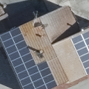

# Solar and photovoltaic panels segmentation

**Installation**
<br/><br/>
This project was developed using a Conda environment with Python 3.11

To install all the packages needed by the project use:

    pip install -r requirements.txt
<br/><br/>
**Training**
<br/><br/>
To train the Neural Network on a custom dataset make sure to respect the following folder structure for the training data:

```
   -- data folder (arbitrary name)
    |
    -- images -> all images
     |
     -- image_name.{png, jpg} 
     -- image_name.{png, jpg} 
     -- image_name.{png, jpg} 
     -- ...
    |
    -- masks -> all masks (file names should be same as train images)
     |
     -- image_name_a.png 
     -- image_name_a.png 
     -- image_name_a.png 
     -- ...
```
<br/><br/>
Example of image with corresponding mask
<br/><br/>



<br/><br/>
Size and color space of images:

    - Make sure you have the same size for all the images
    - Make sure you have RGB color space for all images
    - if you need you can use utils/resize_and_img_format.py file

Mask and classes values values (tested only for these values it might also work for multi labels but you need to adjust the classes)

    - Make sure the masks are the same size as the images
    - Make sure the masks are grayscale (1 channel)
    - Make sure mask values are only two i.e either 0 or 255
    - if you need you can use utils/convert_to_binary.py file

Run the following script:

    python train.py --data <data folder> --epochs 100 --batch-size 4
<br/><br/>
**Prediction**
<br/><br/>
To run the prediction on a set of images run the script:

    python predict.py --model <saved models folder>/checkpoint_epoch100.pth -i <images_folder> --viz --no-save

To run the prediction on a GeoTIFF use the script:

    python predict_on_geotiff.py --model <saved models folder>/checkpoint_epoch100.pth -i <GeoTIFF file path> -o <output path>
